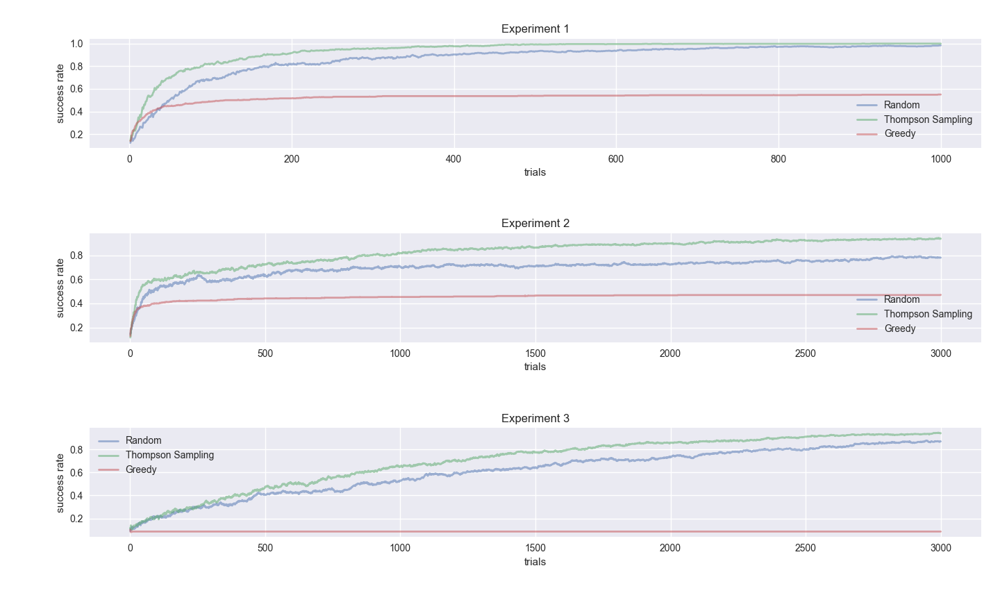

# Bayesian Active Learning on Multi-armed Bandit
This repository simulates the Bayesian active learning on Multi-armed Bandit using Beta prior. Three different agents are running on the stationary multi-armed bandit machine each of which uses a different strategy for balancing between exploration and exploitation
1. TS - TS agent select the arm according to the result of Thompson Sampling on the posterior probability of each arm.
2. R - R agent randomly selects the arm at each iteration
3. G - G agent greedily selects the arm that has a maximum mean posterior estimate

## Settings
10 arms, flat Beta prior (i.e., $\alpha$, $\beta$ = 1)

* Experiment 1 
$$θ_1 = 0.9, θ_2 = 0.8, θ_3 = θ_4, . . . = θ_{10} = 0.5$$
* Experiment 2
$$θ_1 = 0.9, θ_2 = 0.88, θ_3 = θ_4, . . . = θ_{10} = 0.5$$
* Experiment 3
$$θ_1 = 0.9, θ_2, θ_3 = θ_4, . . . = θ_{10} = 0.5$$

## Results
